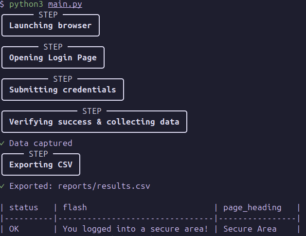
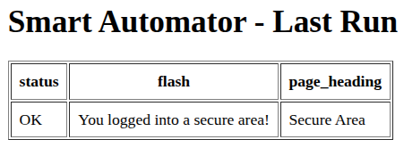
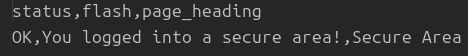

# Smart Workflow Automator (Selenium + Python)

A production-grade Selenium demo showcasing **login automation**, **data extraction**, and **report generation** — all built with clean architecture, headless execution, and automated testing.


---

## ⚙️ Features

- **Automated Login Flow** – logs into a demo site and verifies success  
- **Data Export** – generates structured CSV reports  
- **Page Object Model (POM)** – clean, modular, and scalable architecture  
- **Rich Logging** – colorful, step-by-step output using `rich`  
- **Automated Testing** – `pytest` integration for continuous validation  
- **Optional Dashboard** – Flask web UI for viewing results  

---

## 🏗️ Project Structure

smart_automator/
├── main.py
├── pages/
├── utils/
├── dashboard/
├── reports/
└── tests/

yaml
Copy code

---

## 🚀 Quick Start

### Run Locally

```bash
git clone https://github.com/KAPSULA1/smart-automator.git
cd smart_automator
python3 -m venv venv && source venv/bin/activate
pip install -r requirements.txt

# Run demo
python main.py

# Run tests
pytest -v
🐳 Run with Docker
bash
Copy code
docker build -t smart-automator .
docker run --rm -v $(pwd)/reports:/app/reports smart-automator
📊 Optional: Dashboard
bash
Copy code
python dashboard/view_results.py
Then open: http://127.0.0.1:5000

🧠 Example Output
🖥️ Terminal Output

📊 Dashboard View

📁 CSV Export

🔍 Tech Stack
Python 3.12

Selenium 4.25

WebDriver Manager

Pytest

Flask

Rich / Tabulate

💬 About This Demo
This project demonstrates professional Selenium automation architecture with:

Reliable headless execution (Ubuntu CI/CD ready)

Modular and testable Page Object Model design

Clean, maintainable, and extensible codebase

Note: GitHub Actions are temporarily disabled on this account — the project is fully CI/CD ready.

📩 Contact
Giorgi Kapo
Python Automation Engineer
📧 giorgikapanadze222@gmail.com
🌐 https://github.com/KAPSULA1
